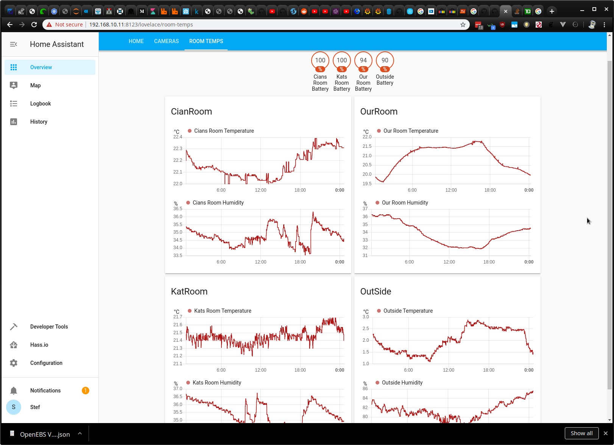

Updated stelford's README.md:

This repo adds support for the Inkbird IBS-TH1 under Home Assistant.



Install this by dropping it into your config folder (path may vary
from install to install). In my install, this would be at
/config/custom_components/inkbird. 

Home Assistant Container Install:
Home Assistant Container should have NET_ADMIN capability
https://stackoverflow.com/questions/38758627/how-can-we-add-capabilities-to-a-running-docker-container
```
# in docker-compose.yml
cap_add:
  - NET_ADMIN
```
Access HA container bash to install bluepy
```
docker exec -it homeassistant bash
# in bash:
pip install --find-links $WHEELS_LINKS bluepy==1.3.0
# From <https://github.com/home-assistant/core/issues/24441> 
# lib cap and setcap may not be needed???
apk add labcap
setcap 'cap_net_raw,cap_net_admin+eip' /usr/local/lib/python3.8/site-packages/bluepy/bluepy-helper
```

Change your /config/configuration.yaml to have something like:
NOTE: MAC address should be lowercase

```
sensor:
  - platform: inkbird
    devices:
      - mac: '90:e2:02:9b:45:3a'
        name: 'Cians Room'
        monitored_conditions:
          - temperature
          - humidity
          - battery
      - mac: '90:e2:02:9b:4b:64'
        name: 'Kats Room'
        monitored_conditions:
          - temperature
          - humidity
          - battery
```

Obviously, the MAC and name you will change to your devices. The MAC you 
can find by using the scan.py inside helper_scripts. You can also
test in a 'once off' fashion by using the test_btle.py script with your
MAC updated inside it. NOTE: help scripts use old method to get values. Final sensor.py uses new method to get fff2 values.

Every time a scan_interval is hit (previously set at 60s)
then the Inkbird.Updater will scan the btle for any broadcasts for 10s.
The Inkbird sends out a broadcast every 10s as well. This means that
from time to time, we won't get lucky and listen at the right time.

That said, there is no more btle connections happening (as it's using
broadcasted data from the devices only now). It's also vastly more
power efficient.
